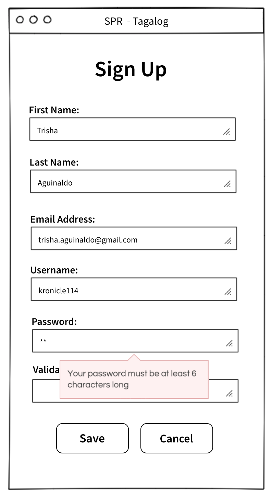
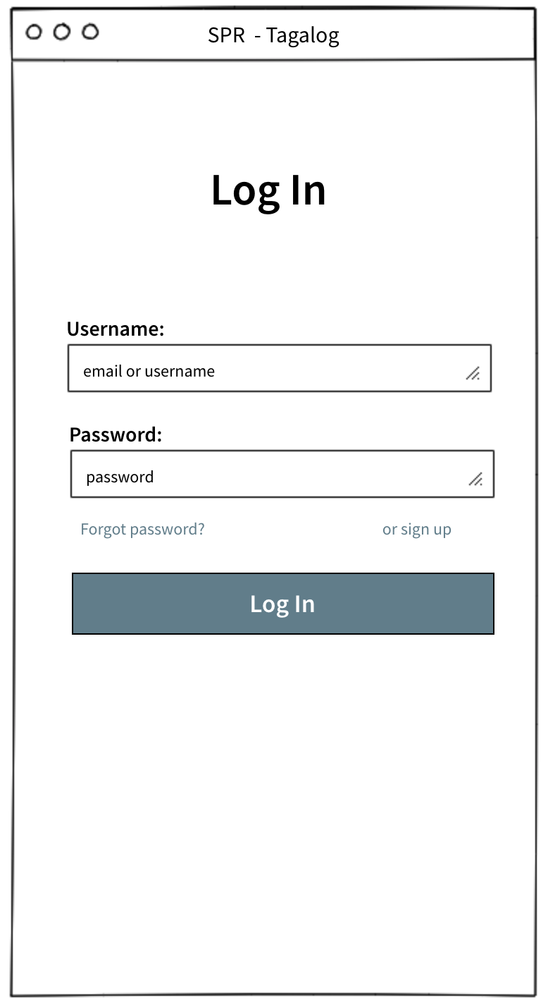
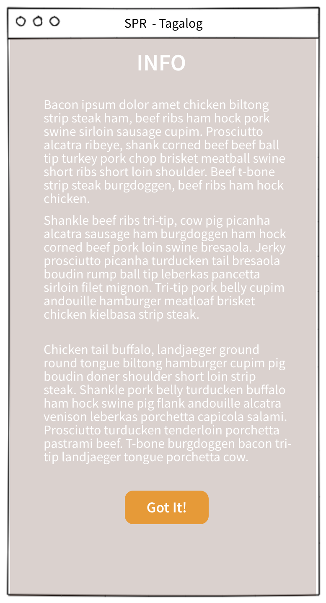
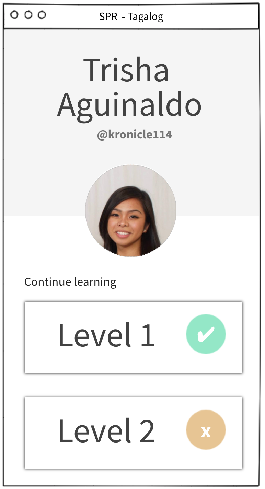
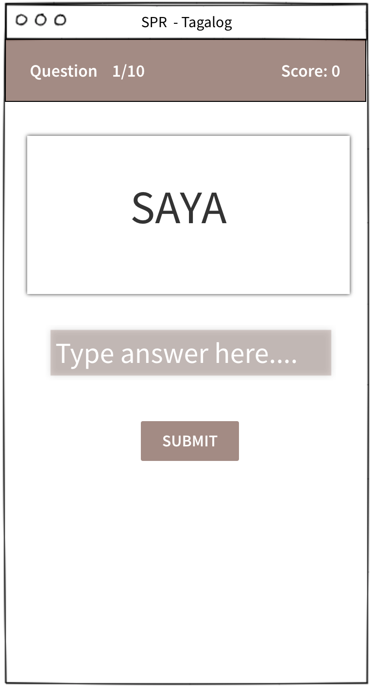
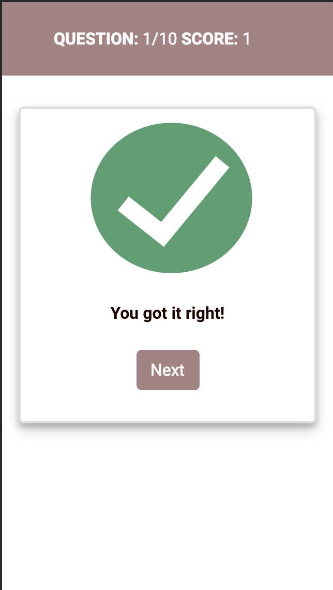
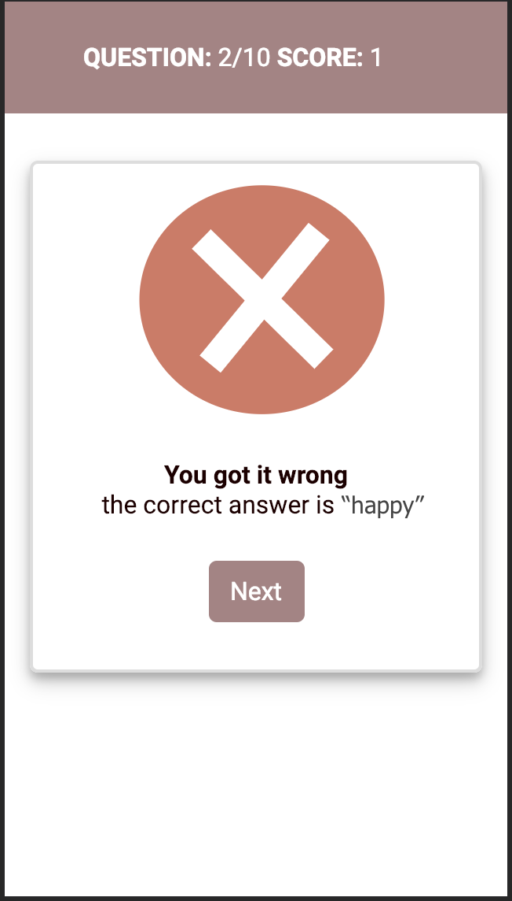
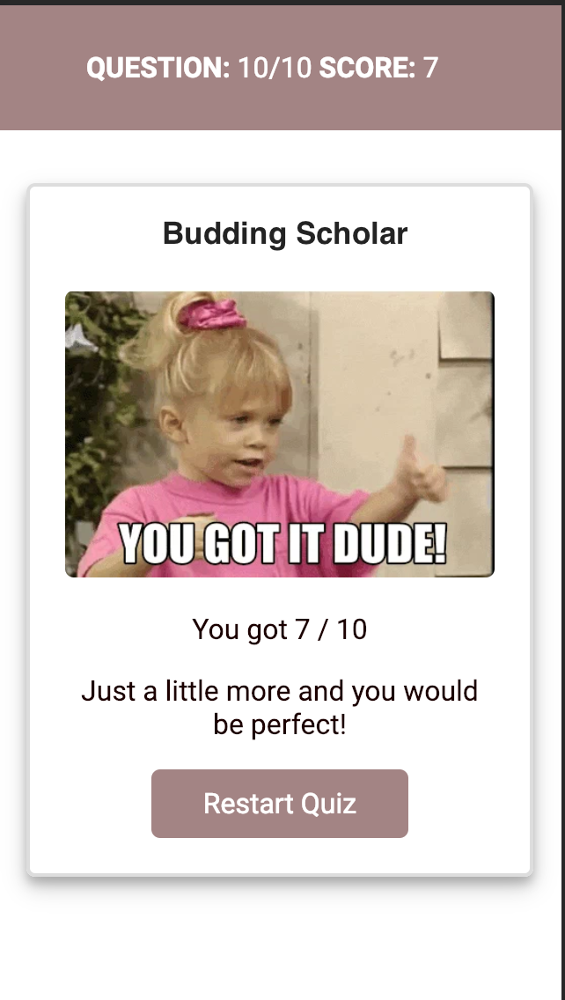

# Tagalog Spaced Repetition

## Quick Links

- [Client Repo](https://github.com/thinkful-ei26/Tagalog-Trisha-Joaquin-client.git)
- [Server Repo](https://github.com/thinkful-ei26/Tagalog-Trisha-Joaquin-server)
- [Deployed Client]()
- [Deployed Server]()

## Instructions for Developers
In development, your local machine should have [Node.js](https://nodejs.org/en/) and [Mongo](https://www.mongodb.com/) set up

1. Clone both the server and client side of this app:
* [Server](https://github.com/thinkful-ei26/Tagalog-Trisha-Joaquin-server.git) or `git clone https://github.com/thinkful-ei26/Tagalog-Trisha-Joaquin-server.git`
* [Client](https://github.com/thinkful-ei26/Tagalog-Trisha-Joaquin-client.git) or `git clone https://github.com/thinkful-ei26/Tagalog-Trisha-Joaquin-client.git`
2. `npm install` the requirements on each of the repos
3. Run `mongod` in a separate terminal shell. 
4. Open a new terminal shell and then `cd` into the server side and run `node server.js`
5. Finally, `cd` into the client side and run `npm start` in a new terminal shell. A new browser window should open containing the app. 

## ------------------ DAY 1 ------------------------

### ======================================
### User Stories and Acceptance Criteria
### ======================================

---

User Story: As an user, I want to know the name and the purpose of the spaced repetition application, so that I can decide whether I want to continue interacting with it.

    Acceptance Criteria:
        When I visit the the spaced repetition site, I see the name of the learning app, and a  brief description 
        of what the app does.

----

User Story: As an user, I want to create an account so that I can use the app.

    Acceptance Criteria:
        When I visit the the spaced repetition site for the first time, I should be directed to a registration page
        On that page, I can enter my name, username, and password 
        My password should be at least 10 characters long
        If all information is correct, upon clicking the submit button, I should be taken to a login page
        If the information is incorrect, I should be given proper error messages and option to enter the 
        correct information
     
---

User Story: As a registered user, I should be able to log into my account, so that I can use the app

    Acceptance criteria:
        When I visit the the spaced repetition site, I should be able to go to a login page
        I can enter my username and password
        If my username and password is correct then the app should accept them and greet me with a message 
        "Hello MY_NAME"
        If my username and password is incorrect then the app should reject my information and the give me meaningful 
        message so I can try to log in again

---

### ======================================
### Wireframes
### ======================================

